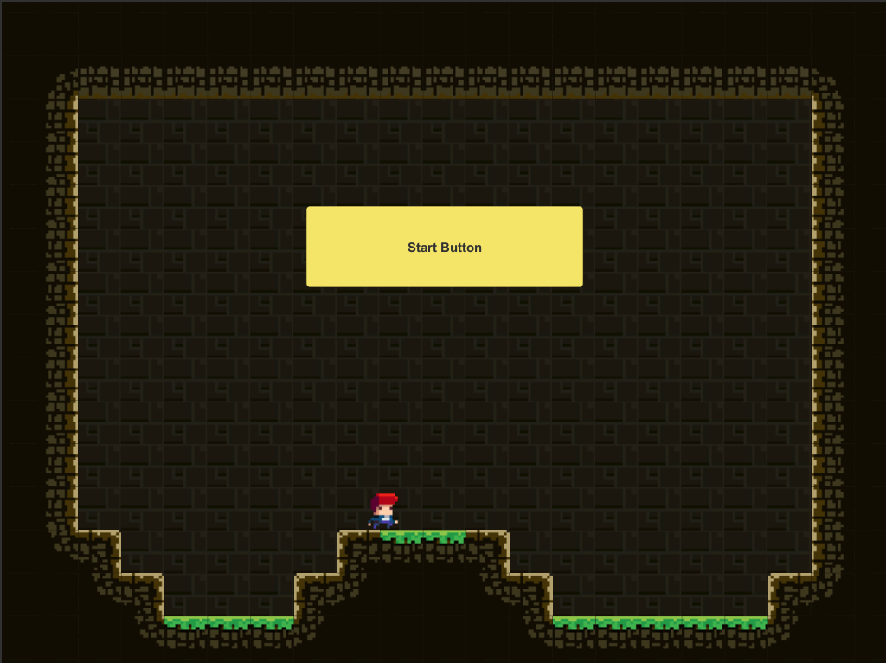
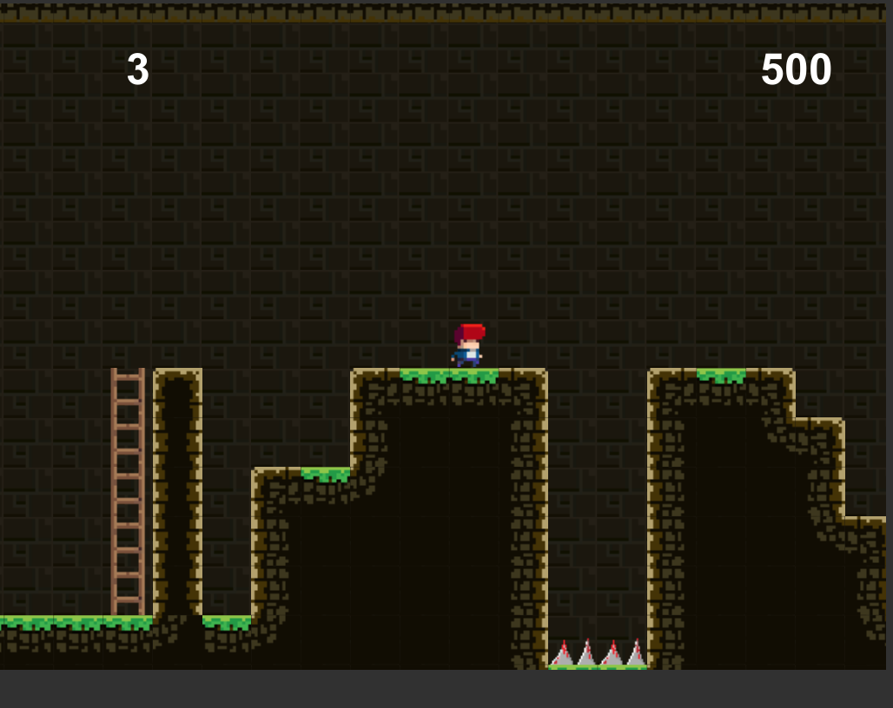

# Jumper
This is a 2D side-scrolling platformer game where the character encounters and interacts with enemies, obstacles and coins – similar to the classic game, Mario. This game is based of a Udemy course.

## Presentational Images
The following section will present some snapshots of the game while running

##### Start Screen

##### Mid Level

##### Different Levels

