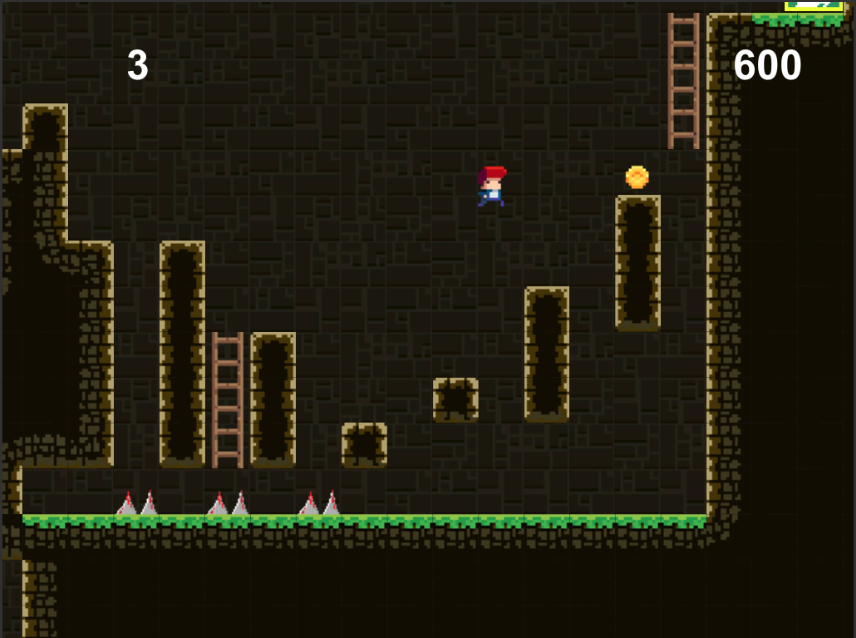

# Jumper
This is a 2D side-scrolling platformer game where the character encounters and interacts with enemies, obstacles and coins – similar to the classic game, Mario. This game is based from a Udemy course	This is a 2D side-scrolling platformer game where the character encounters and interacts with enemies, obstacles and coins – similar to the classic game, Mario. This game is based of a Udemy course.

## Presentational Images
The following section will present some snapshots of the game while running

##### Developing Phase

##### Start Screen

##### Level 1 Snapshot

##### Level 2 Snapshot

##### Climbing Stairs Animation

##### Jumping Blocks Animmation

